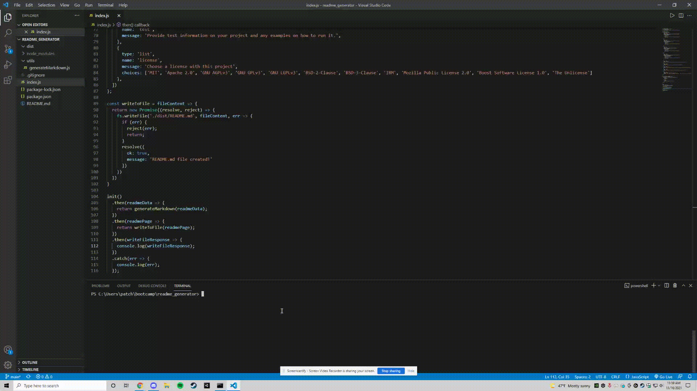

# Node.JS ReadMe Generator

:mag:

This is a node.js application powered by JavaScript that dynamically generates a README.md file based on input.

Every good project needs a quality README with quality information, such as purpose, description, installation guidelines, usage and how to make contributions with other developers to contribute to the success of the project.

## Table of Contents

* [Setup](#setup)
* [Usage](#usage)
* [Contributing](#contributing)

## Setup
:floppy_disk:

Requires Node.js and npm (Node Package Manager). Go to [Node's website](https://nodejs.org/en/) and follow the download instructions for your appropriate setup. NPM, or Node Package Manager, is the default package manager for Node.js. It is distributed with Node.js. Do not forget to npm init if you are using it for the very first time.

Run `npm install` in order to install the following npm package dependencies as specified in the `package.json`:
- [inquirer.js](https://www.npmjs.com/package/inquirer) will prompt you for inputs from the command line.

`npm init`

`npm install inquirer`

Start the application by running `node index.js` in the command line.

## Usage

:computer:

Either fork or clone this repository and open the files within to access the command prompt.

Run `node index.js` and the command prompt will use the inquirer package to prompt you with a series of questions about your GitHub username, email and project.

The application will take the response to generate markdown and a table of contents for the README. Certain unanswered prompts will be left blank. Other prompts will be required, such as your GitHub username and project title. The README will also include license and badge for your GitHub repo.

`fs.writeFile` will then generate the project's README.md file within the "dist" folder.

## Contributing

:octocat:

[Pat Chen](https://github.com/paperpatch)
